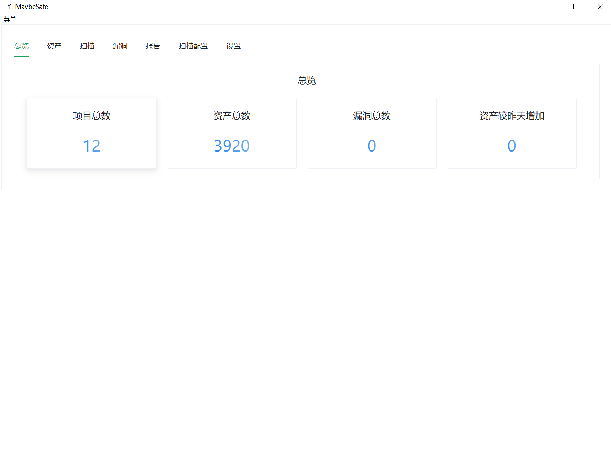
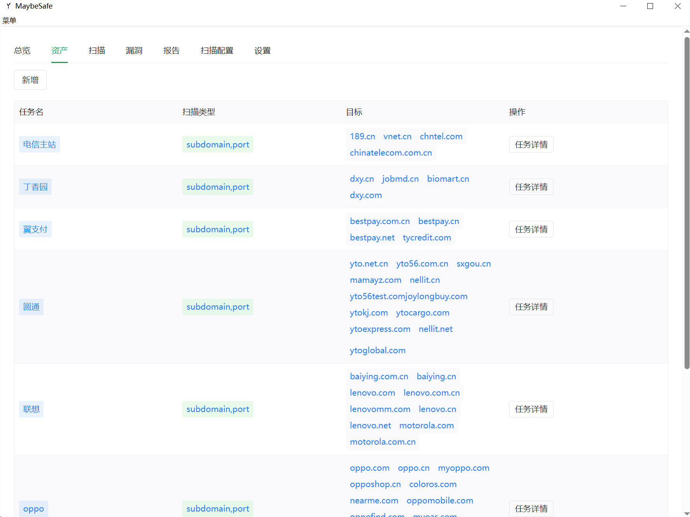
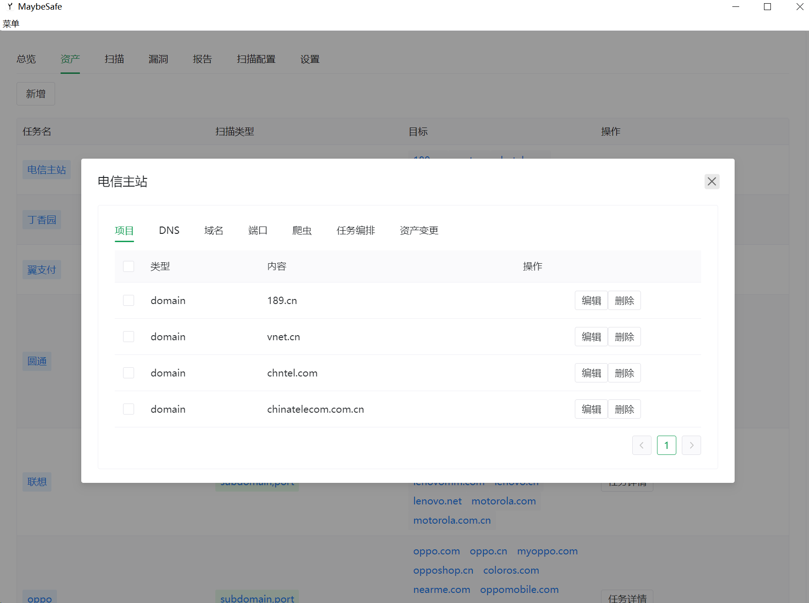
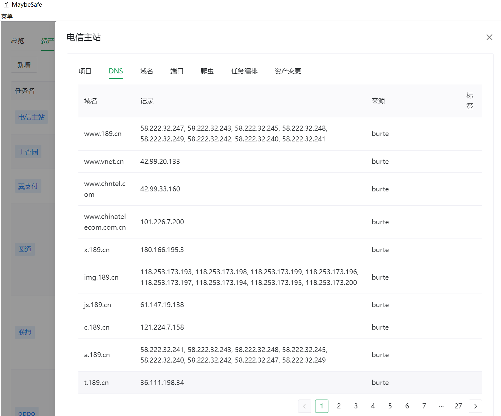
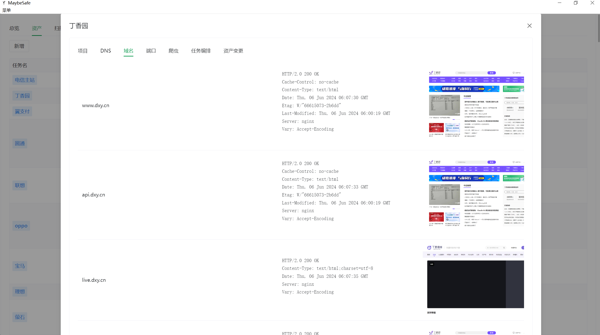
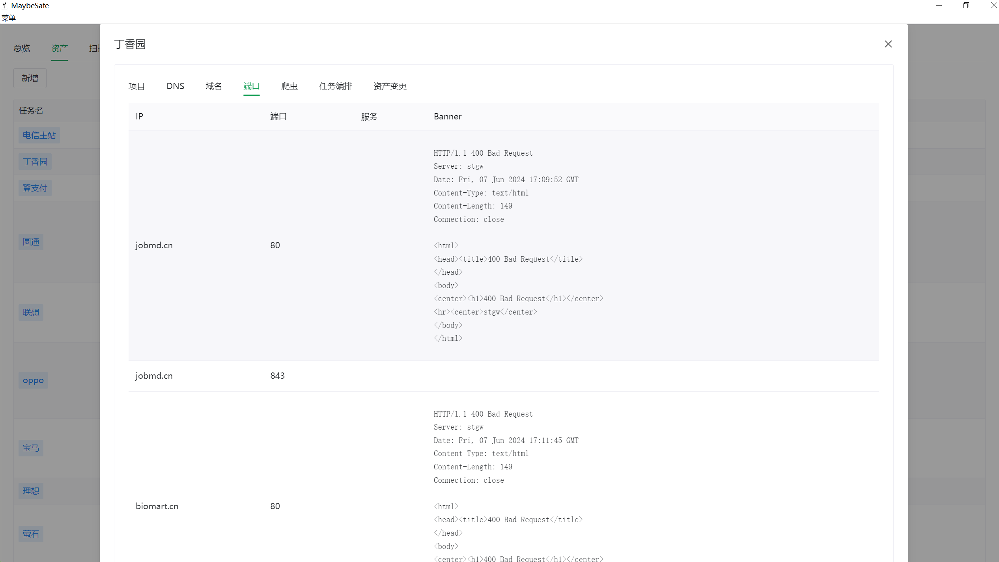
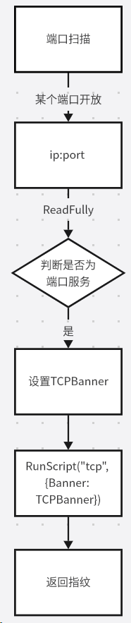

# 技术栈
Vue3 + Navie UI + Wails + sqlite
# 主界面

# 资产管理

## 任务详情
## 项目编辑

## DNS

## 域名

## 端口

## 爬虫
## 任务编排
## 资产变更
# 计划
下面几个功能将后续加入
- 企查查、天眼查监控
- POC扫描
- http、tcp指纹
- 自动化扫描
- 资产聚合
- ...
## 企查查
准备使用两种方案对企查查进行数据清洗
1. 使用默认的内置方法
2. 使用js编写自定义数据筛选和监控
## 指纹
对banner深度解析，使用js编写指纹脚本

例如判断mysql服务及版本
```javascript
var finger = "" //指纹名称

var version = "" // 服务版本

// 上面俩个参数为暴露变量, 方便后端读取

  
var proto = "tcp"

  
if (proto !== type) {

    throw SyntaxError();

}

// datasource.banner 为上层服务传入的tcpbanner, 类型为[]byte
var index = findBytesIndex(datasource.banner, [0, 0, 0, 10]) + 4

var version_temp = []
for (;index<datasource.banner.length; index++) {

    var t = datasource.banner[index]

    if (datasource.banner[index] === 0 ){

        version = string(version_temp);

        finger = "mysql"

        break

    }

    version_temp.push(t) 
}
```